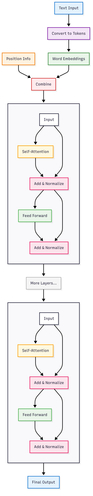

# 🚀 Transformers from Scratch: A Beginner's Journey

**📜 Original Paper:** [Attention Is All You Need](https://arxiv.org/abs/1706.03762)

Hey! 👋

So you’ve heard about Transformers but have no idea how to build them from scratch?  
Tried reading the paper but got lost in all the math and jargon? Don’t worry — you’re not alone!

This repository is your **step-by-step guide** to implementing the Transformer architecture from scratch using **PyTorch** (or even TensorFlow if you prefer).  
We’ll go **module by module**, breaking everything down into simple, beginner-friendly concepts.

---

## 🎯 What’s the Goal?

The main goal is **not just to copy** a Transformer implementation, but to **understand how it works** so that you can:

- 🛠️ Build your own Transformer from scratch  
- 🔧 Fine-tune models for tasks like binary classification, machine translation, etc.  
- 🧪 Modify or extend the architecture (like building GPT-style models!)  
- 📖 Read and understand modern research papers better  

---

## 🧱 What You'll Learn

- Positional encoding (and why it’s needed)
- Self-attention and multi-head attention
- The full encoder-decoder architecture
- Layer normalization, residual connections, masking, and more

---

> 💡 Don’t worry if you don’t understand what these terms mean right now — that’s totally okay!  
> You’ll get it step by step as we build everything from the ground up.  

## 🧠 Architecture Overview

We’ll be implementing **only the encoder** portion of the original Transformer architecture in this project.

> 📌 Don’t worry if the diagram looks intimidating — we’ll break it down step by step and implement each part from scratch!
